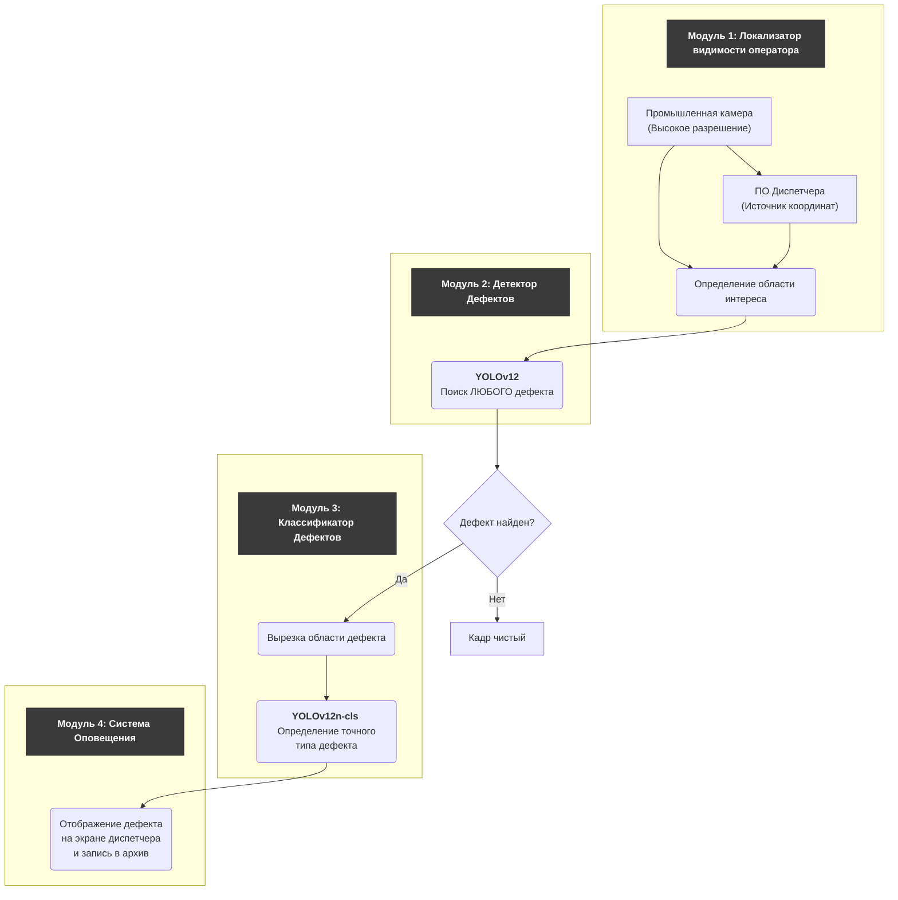

#### Вектор целей:

1.  Сбор кадров и разметка. Попробовать реализовать локализатор и после него записывать кадры, а не в оригинальном разрешении, дабы не переполнять память.
    -   Сбор Эталонного Бенчмарка – Достаточно размеченных кадров с разных станков, с разным освещением.
    -   Сбор основного датасета. Также с разным освещением, с разными углами, в разные дни.

2.  Разделить работу детекции на:
    -   Локализатор (с экрана диспетчера).
    -   Детекцию (обрезка, изменение разрешения в `yolo`, прогноз).

3.  Подавать на вход 1 канал: `model.train(..., channels=1)`.

4.  Добавить аугментаций из `albumentations`, например:
    -   `RandomBrightnessContrast`: Имитация разной яркости.
    -   `GaussNoise`: Имитация шума камеры.
    -   `MotionBlur`: Имитация смаза при движении.
    -   `ShiftScaleRotate`: Небольшие сдвиги и повороты, имитирующие разный ракурс.

5.  Решать задачу детекции дефекта без их различия.

6.  В дальнейшем поверх настроить `yolo` для задачи классификации, обучить ее, и запускать после детекции и обрезки с небольшим запасом по бокам (возможно без запаса).

#### **Операционный Цикл (Real-Time)**

