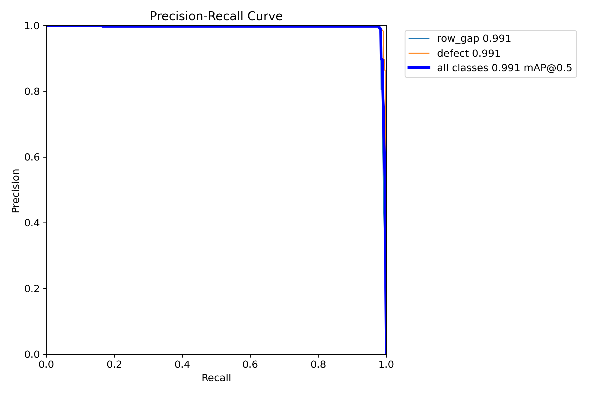
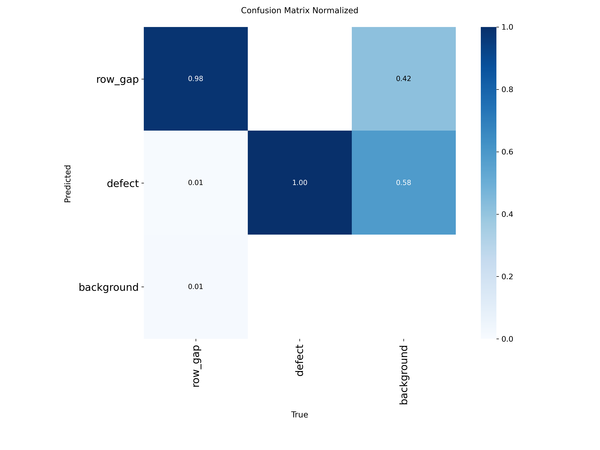

# Детектор дефектов намотки

Комплексная система компьютерного зрения для обнаружения дефектов в промышленных процессах намотки. Проект использует модель **YOLOv12** и представляет собой полный **MLOps-пайплайн**: от подготовки данных и обучения модели до развертывания в виде потокового real-time сервиса. Вся среда контейнеризирована с помощью **Docker** для обеспечения воспроизводимости и простоты развертывания.

---

## Содержание

- [Ключевые возможности](#ключевые-возможности)
- [Технологический стек](#технологический-стек)
- [Результаты обучения](#результаты-обучения)
- [Структура проекта](#структура-проекта)
- [ML Пайплайн](#ml-пайплайн)
- [Установка и запуск](#установка-и-запуск)
- [Использование](#использование)
  - [1. Обучение модели](#1-обучение-модели)
  - [2. Отслеживание экспериментов в MLflow](#2-отслеживание-экспериментов-в-mlflow)
  - [3. Запуск сервера для инференса](#3-запуск-сервера-для-инференса)
- [Вспомогательные скрипты](#вспомогательные-скрипты)

---

## Ключевые возможности

- **Высокопроизводительная детекция:** Используется state-of-the-art модель YOLOv12 для точного и быстрого обнаружения объектов.
- **End-to-End MLOps:** Реализован полный цикл машинного обучения, включая отслеживание экспериментов с помощью **MLflow**.
- **Контейнеризация (Docker):** Применение Docker и Docker Compose гарантирует консистентность и воспроизводимость окружения для обучения и развертывания.
- **Real-time инференс:** Flask-сервер для потоковой передачи видео с наложенными результатами детекции в реальном времени.
- **Автоматизированный пайплайн обучения:** Скрипт `run_training.sh` с расширенными настройками аугментации данных для обучения робастных моделей.
- **Поддержка GPU:** Docker-окружение настроено для использования NVIDIA GPU, что значительно ускоряет обучение и инференс.
- **Модульность и расширяемость:** Кодовая база организована в логические модули для обработки данных, обучения и инференса.

---

## Технологический стек

- **Бэкенд и ML:** Python 3.12
- **Deep Learning:** PyTorch, Ultralytics (YOLOv12)
- **Сервер для инференса:** Flask
- **MLOps:** MLflow
- **Контейнеризация:** Docker, Docker Compose
- **Обработка данных:** OpenCV, NumPy, Albumentations
- **Конфигурация:** PyYAML

---

## Результаты обучения

Модель была обучена на протяжении 250 эпох. Ниже представлены ключевые метрики и графики для одного из экспериментов (`WDD_v1`).

### Ключевые метрики

| Метрика             | Значение |
| ------------------- | -------- |
| **Precision**       | **~0.993** |
| **Recall**          | **~0.986** |
| **mAP50**           | **~0.993** |
| **mAP50-95**        | **~0.845** |

Эти метрики свидетельствуют о высокой точности и полноте модели, что критически важно для промышленных задач.

### Визуализация результатов

*   **PR-кривая (Precision-Recall):** Демонстрирует оптимальный баланс между точностью и полнотой.
    

*   **Матрица ошибок (Normalized Confusion Matrix):** Показывает, что модель практически не путает классы.
    

---

## Структура проекта

Проект организован в две основные директории: `data` для данных и `src` для исходного кода.

```
.
├── data/
│   ├── 00_pretrained/    # Базовые модели (например, yolov8m.pt)
│   ├── 01_raw/           # Исходные видео и изображения
│   ├── 02_processed/     # Обработанные данные (например, нарезанные кадры)
│   ├── 03_annotations_raw/ # "Сырые" аннотации (например, из CVAT)
│   ├── 04_datasets/      # Датасеты в формате YOLO
│   ├── 05_runs/          # Результаты запусков обучения (веса, логи)
│   └── 06_prelabeled/    # Данные для автоматической разметки
│
├── src/
│   ├── utils/            # Вспомогательные скрипты
│   ├── data_processing.py # Скрипты для подготовки данных
│   ├── train.py          # Скрипт обучения с интеграцией MLflow
│   ├── inference_server.py # Flask-сервер для real-time стриминга
│   └── ...               # Другие утилиты
│
├── .dockerignore
├── .gitignore
├── config.yaml           # Конфигурация датасета для YOLO
├── docker-compose.yml    # Файл для запуска сервисов detector и mlflow
├── Dockerfile            # Docker-образ приложения
├── README.md             # Этот файл
└── requirements.txt      # Зависимости Python
```

---

## ML Пайплайн

Проект следует стандартному MLOps-подходу, который управляется через структуру директорий:

1.  **Сбор данных:** Исходные видео помещаются в `data/01_raw/`.
2.  **Аннотирование:** Данные размечаются с помощью CVAT или аналогичных инструментов. Аннотации сохраняются в `data/03_annotations_raw/`.
3.  **Подготовка датасета:** Скрипты (например, `run_data_prep.py`) обрабатывают "сырые" данные и создают датасет в формате YOLO в `data/04_datasets/`.
4.  **Обучение модели:** Скрипт `train.py` использует подготовленный датасет для обучения модели YOLOv12. Все результаты (веса, метрики) сохраняются в `data/05_runs/` и логируются в MLflow.
5.  **Развертывание:** Лучшая модель используется `inference_server.py` для отдачи предсказаний в реальном времени.

---

## Установка и запуск

Проект предназначен для запуска с помощью Docker и Docker Compose. Убедитесь, что у вас установлены **Docker**, **Docker Compose** и **NVIDIA GPU** с соответствующими драйверами.

1.  **Клонируйте репозиторий:**
    ```bash
    git clone https://github.com/ваш-логин/winding-defect-detector.git
    cd winding-defect-detector
    ```

2.  **Подготовьте данные и предобученные модели:**
    - Поместите видео/изображения в `data/01_raw/`.
    - Скачайте предобученную модель YOLO и поместите ее в `data/00_pretrained/`.
    - Создайте датасет в формате YOLO и поместите его в `data/04_datasets/`.
    - Обновите `config.yaml`, чтобы он указывал на ваши данные для обучения и валидации.

3.  **Соберите и запустите сервисы:**
    Выполните команду ниже, чтобы собрать Docker-образы и запустить контейнеры `detector` и `mlflow-server` в фоновом режиме.

    ```bash
    docker compose up --build -d
    ```
    - Сервис `detector` будет содержать окружение приложения.
    - Сервис `mlflow-server` будет доступен для отслеживания экспериментов.

---

## Использование

Все команды должны выполняться из корневой директории проекта.

### 1. Обучение модели

Процесс обучения управляется скриптом `run_training.sh`, который запускает `src/train.py` внутри контейнера `detector` с большим набором параметров.

- **Настройте обучение:** При необходимости измените параметры в `run_training.sh` (эпохи, размер батча, настройки аугментации).
- **Запустите обучение:**
  ```bash
  ./run_training.sh
  ```
  Скрипт автоматически залогирует все параметры, метрики и артефакты модели в MLflow.

### 2. Отслеживание экспериментов в MLflow

После запуска сервисов вы можете открыть интерфейс MLflow в браузере для мониторинга запусков.

- **URL:** [http://localhost:5001](http://localhost:5001)

Здесь вы можете сравнивать разные эксперименты, просматривать графики метрик (mAP, precision, recall) и скачивать лучшие веса модели (`best.pt`).

### 3. Запуск сервера для инференса

Чтобы запустить модель как сервис для детекции на видеопотоке, выполните `inference_server.py` внутри контейнера `detector`.

1.  **Найдите путь к лучшей модели:** Обычно он находится в `data/05_runs/ИМЯ_ЭКСПЕРИМЕНТА/weights/best.pt`.

2.  **Выполните команду для запуска сервера:**
    ```bash
    docker compose exec detector python3 src/inference_server.py \
        --model_path /app/data/05_runs/ИМЯ_ЭКСПЕРИМЕНТА/weights/best.pt \
        --source /путь/к/видео/или/потоку \
        --confidence 0.6
    ```
    - `--model_path`: Путь к файлу модели `.pt`.
    - `--source`: Путь к видеофайлу (например, `/app/data/01_raw/my_video.mp4`), ID камеры (`0`) или URL сетевого потока.
    - `--confidence`: Порог уверенности для детекций.

3.  **Просмотр стрима:**
    Откройте браузер и перейдите по адресу:
    - **URL:** `http://<IP_АДРЕС_ВАШЕЙ_МАШИНЫ>:5000/video_feed` (замените `<IP_АДРЕС_ВАШЕЙ_МАШИНЫ>` на ваш локальный IP).

---

## Вспомогательные скрипты

В директориях `src/` и `src/utils/` находятся полезные скрипты для управления данными:

- `create_cvat_chunks.py`: Разбивает длинные видео на короткие фрагменты для удобства разметки в CVAT.
- `yolo_to_cvat_xml.py`: Конвертирует аннотации из формата YOLO обратно в XML для CVAT.
- `sanitize_filenames.py`: Очищает имена файлов от спецсимволов.
- `prelabel.py`: Скрипт для предварительной автоматической разметки новых данных с помощью уже обученной модели.
- `...и другие.`
